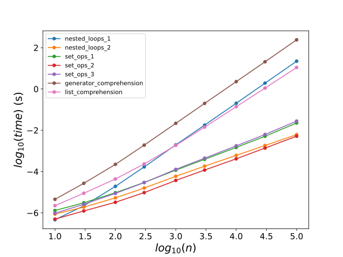

# Performance

The [Approaches page][approaches-page] discusses various ways to approach this exercise, with substantially different performance.

## Measured timings

The 7 code implementations described in the various approaches were [benchmarked][benchmark-code], using appropriate values for the upper limit of `n` and number of runs to average over, to keep the total testing time reasonable.

Numerical results are tabulated below, for 9 values of the upper search limit (chosen to be about equally spaced on a log scale).

|                         |       10 |       30 |       100 |       300 |       1000 |       3000 |    10,000 |      30,000 |   100,000 |
|:------------------------|---------:|---------:|----------:|----------:|-----------:|-----------:|----------:|------------:|----------:|
| nested quadratic        | 4.64e-07 | 2.19e-06 |  1.92e-05 |  1.68e-04 |   1.96e-03 |   1.78e-02 |  2.03e-01 |    1.92e+00 |  2.22e+01 |
| nested linear           | 8.72e-07 | 1.89e-06 |  5.32e-06 |  1.60e-05 |   5.90e-05 |   1.83e-04 |  6.09e-04 |    1.84e-03 |  6.17e-03 |
| set with update         | 1.30e-06 | 3.07e-06 |  9.47e-06 |  2.96e-05 |   1.18e-04 |   3.92e-04 |  1.47e-03 |    5.15e-03 |  2.26e-02 |
| set with sort 1         | 4.97e-07 | 1.23e-06 |  3.25e-06 |  9.57e-06 |   3.72e-05 |   1.19e-04 |  4.15e-04 |    1.38e-03 |  5.17e-03 |
| set with sort 2         | 9.60e-07 | 2.61e-06 |  8.76e-06 |  2.92e-05 |   1.28e-04 |   4.46e-04 |  1.77e-03 |    6.29e-03 |  2.79e-02 |
| generator comprehension | 4.54e-06 | 2.70e-05 |  2.23e-04 |  1.91e-03 |   2.17e-02 |   2.01e-01 |  2.28e+00 |    2.09e+01 |  2.41e+02 |
| list comprehension      | 2.23e-06 | 8.94e-06 |  4.36e-05 |  2.35e-04 |   1.86e-03 |   1.42e-02 |  1.39e-01 |    1.11e+00 |  1.10e+01 |

For the smallest input, all times are fairly close to a microsecond, with about a 10-fold difference between fastest and slowest.

In contrast, for searches up to 100,000 the timings varied by almost 5 orders of magnitude.

This is a difference between milliseconds and minutes, which is very hard to ignore.

## Testing algorithmic complexity

We have discussed these solutions as `quadratic` or `linear`.
Do the experimental data support this?

For a [power law][power-law] relationship, we have a run time `t` given by `t = a * n**x`, where `a` is a proportionality constant and `x` is the power.

Taking logs of both sides, `log(t) = x * log(n) + constant.`

Plots of `log(t)` against `log(n)` will be a straight line with slope equal to the power `x`.

# ***Remove graph before merge!***

Graphs of the data (not shown) show that these are all straight lines for larger values of `n`, as we expected.

Linear least-squares fits to each line gave these slope values:

| Method           | Slope |
|:-----------------|:-----:|
| nested quadratic | 1.95  |
|    nested linear | 0.98  |
|  set with update | 1.07  |
|  set with sort 1 | 1.02  |
|  set with sort 2 | 1.13  |
| generator comprehension | 1.95 |
| list comprehension | 1.69 |

Clearly, most approaches have a slope of approximately 1 (linear) or 2 (quadratic).

The `list-comprehension` approach is an oddity, intermediate between these extremes.

[approaches-page]: https://exercism.org/tracks/python/exercises/sieve/approaches
[benchmark-code]: https://github.com/exercism/python/blob/main/exercises/practice/sieve/.articles/performance/code/Benchmark.py
[power-law]: https://en.wikipedia.org/wiki/Power_law